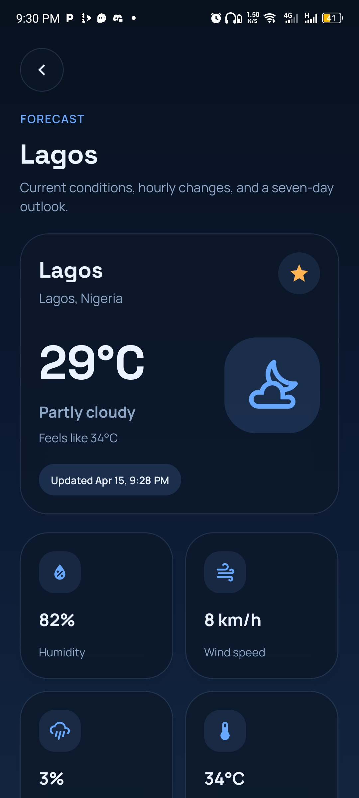
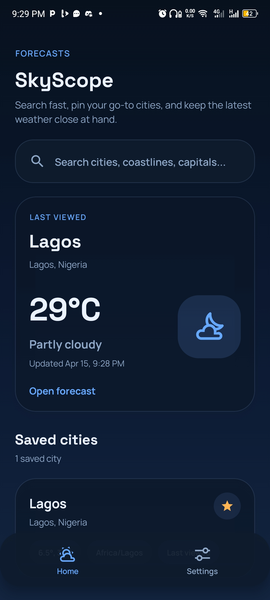
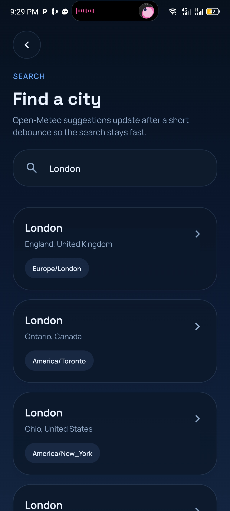
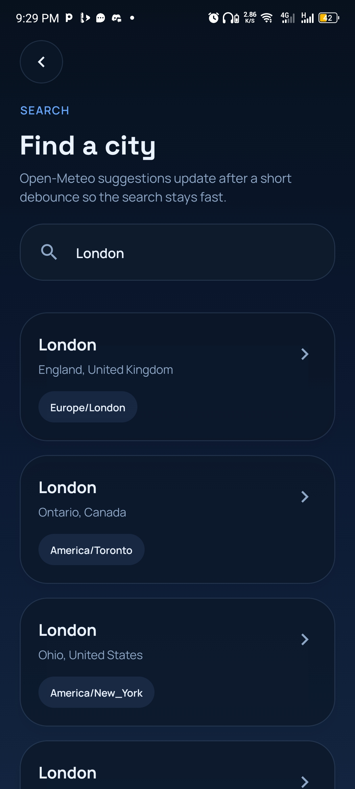
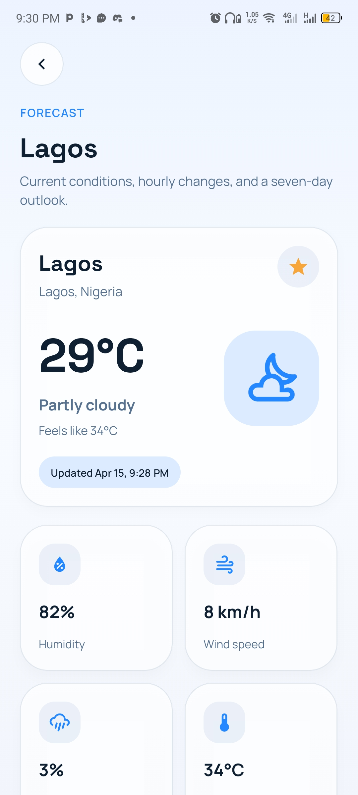
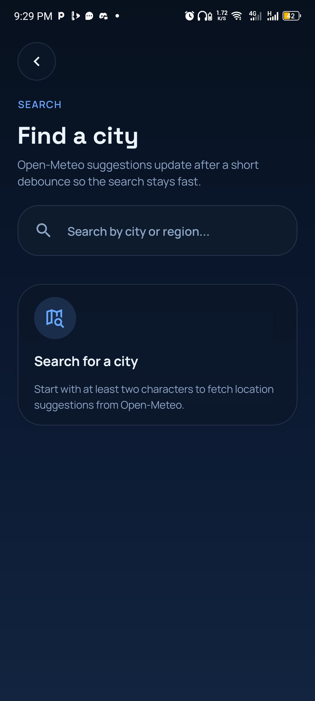
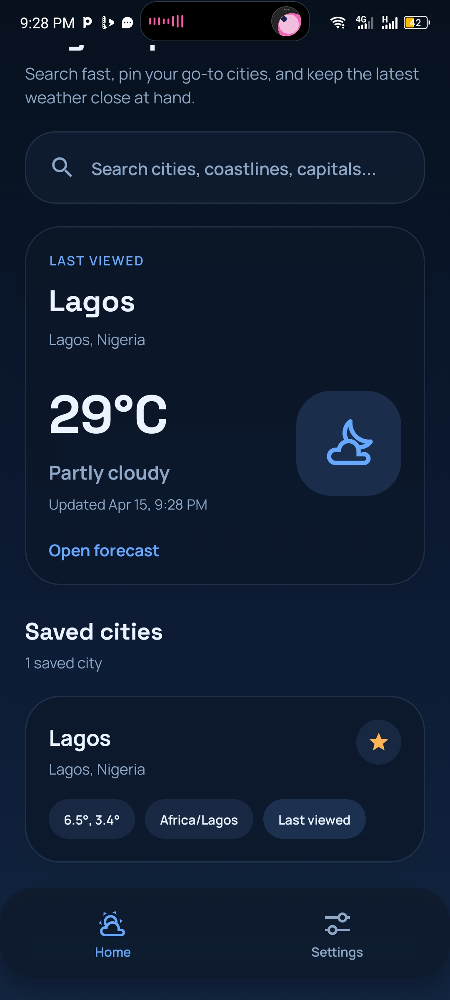
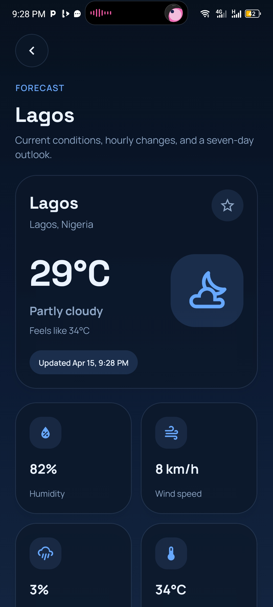
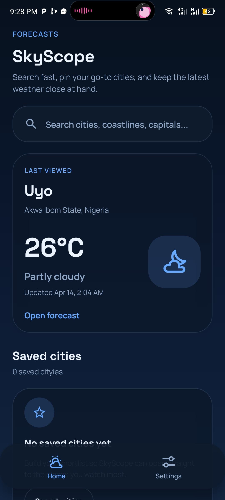
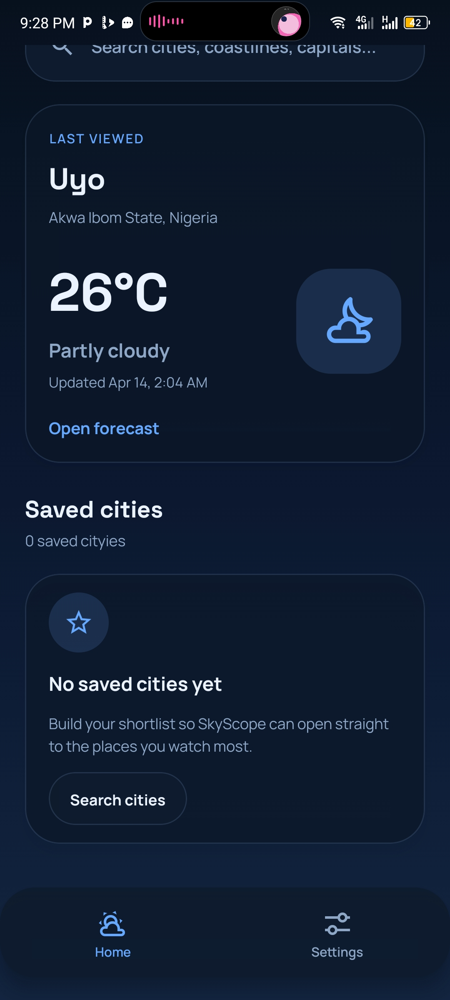

# SkyScope

SkyScope is a production-style Expo weather app built with React Native, TypeScript, Expo Router, Zustand, and TanStack Query. It uses Open-Meteo geocoding for search suggestions and Open-Meteo forecast data for current conditions, hourly outlooks, and seven-day forecasts.

## Stack

- Expo SDK 54
- React Native + TypeScript
- Expo Router
- Zustand with AsyncStorage persistence
- TanStack Query for server state and caching
- React Native Reanimated for motion and skeleton shimmer
- React Native SVG for the temperature trend chart
- Jest + React Native Testing Library

## Features

- Dashboard with a search entry point and saved city list
- Debounced search backed by Open-Meteo geocoding
- Weather detail screen with current conditions, hourly forecast, daily forecast, chart, and metrics
- Favorite and unfavorite flows with duplicate protection
- Persisted favorites and last-viewed forecast snapshot
- Offline fallback when a cached forecast exists
- Pull to refresh
- Empty and retry states
- Theme mode and temperature unit preferences
- Dark mode support

## Project Structure

```text
app/
  (tabs)/
    index.tsx
    settings.tsx
  city/[id].tsx
  search.tsx
src/
  core/providers/
  features/
    cities/
    search/
    settings/
    weather/
  shared/
    components/
    hooks/
    query/
    theme/
    utils/
```

## Architecture Notes

- `app/` contains only Expo Router route files and layouts.
- `src/features/search/api` and `src/features/weather/api` contain typed DTOs, API clients, and mapper functions.
- `src/features/weather/weather.repository.ts` handles the network-first forecast flow with cached fallback.
- Zustand persists city favorites, known city records, last viewed city, theme mode, and unit preference through AsyncStorage.
- TanStack Query owns request lifecycles, cache invalidation, refresh state, and retry behavior.
- Shared UI primitives live in `src/shared/components` so cards, skeletons, error states, and headers stay consistent.

## API References

- Geocoding: `https://geocoding-api.open-meteo.com/v1/search?name={query}&count=10&language=en&format=json`
- Forecast: `https://api.open-meteo.com/v1/forecast`

SkyScope requests:

- `current=temperature_2m,apparent_temperature,relative_humidity_2m,wind_speed_10m,precipitation_probability,weather_code,is_day`
- `hourly=temperature_2m,precipitation_probability,weather_code`
- `daily=weather_code,temperature_2m_max,temperature_2m_min,precipitation_probability_max,sunrise,sunset`
- `timezone=auto`

## Setup

1. Install dependencies:

```bash
npm install
```

2. Start the app:

```bash
npx expo start
```

3. Run tests:

```bash
npm test
```

## Verification Performed

- `npx tsc --noEmit`
- `npm test -- --runInBand`
- `npx expo export --platform android`
- `npx expo-doctor`

## 📱 Demo

- APK: https://expo.dev/accounts/druidivine/projects/skyscope/builds/862abaf8-cafa-403f-b022-b0d15fbd9213

## Screenshot Checklist
      .jpeg>)    

## Future Improvements

- Native location permission and a current-location card
- More granular unit controls for wind speed and precipitation
- Persisted TanStack Query cache hydration for broader offline support
- Widget and notification support for severe weather summaries
- Visual refresh of app icons and splash assets
